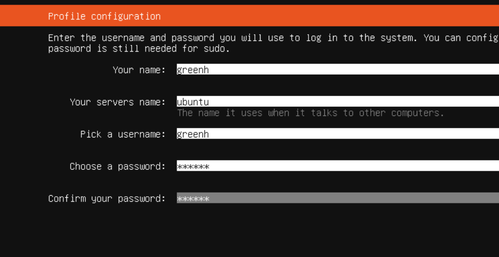
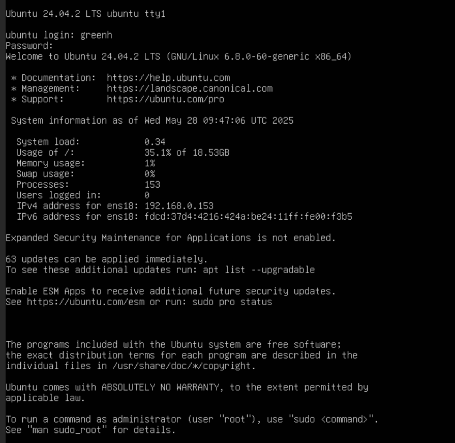

[Create a Ubuntu VM in Proxmox and setup networking | Snel.com](https://www.snel.com/support/ubuntu-vm-in-proxmox-and-networking-setup/)  

[Installing ubuntu server 24 04LTS on Proxmox 8 - YouTube](https://www.youtube.com/watch?v=wMtSGAVxQ9o)  


```
ssh greenh@192.168.0.153
```
# network setting
Ubuntu 24.04 uses Netplan + systemd-networkd by default, so you set both a static address and custom DNS by editing a small YAML file and re-applying it. Below is a concise run-book you can execute over your current SSH session; afterwards Outlook-style validation tips confirm everything is working.Ubuntu 24.04 默认使用 Netplan + systemd-networkd ，因此您可以通过编辑一个小型 YAML 文件并重新应用它来设置静态地址和自定义 DNS。下面是一个简洁的运行手册，您可以在当前的 SSH 会话中执行；之后，Outlook 风格的验证提示将确认一切正常。
## Prepare and back-up1 准备和备份

```bash
sudo mkdir -p /etc/netplan/backup 
sudo cp /etc/netplan/*.yaml /etc/netplan/backup/ 
ip a            # confirm the NIC name (ens18 in your screenshot)
```

Backing up before changes is recommended in all Netplan docs to avoid lock-outs. 所有 Netplan 文档都建议在更改之前进行备份，以避免锁定。

##  Write the static configuration2 编写静态配置

Create or edit `/etc/netplan/01-static.yaml`:创建或编辑 `/etc/netplan/01-static.yaml`

```yaml
network:
  version: 2
  renderer: networkd      # default on Server; keep NetworkManager on Desktop
  ethernets:
    ens18:
      dhcp4: false
      addresses: [192.168.0.153/24]     # <-- static IP
      gateway4: 192.168.0.1             # adjust to your router if different
      nameservers:
        addresses: [192.168.0.200, 1.1.1.1]

```

apply the setting  
```bash
sudo netplan generate    # syntax check
sudo netplan apply       # puts the config live
```

**Tip:** If you lose the SSH session because the IP changed, reconnect with the new address. Netplan rolls back automatically after 120 seconds if it cannot reach the network. [netplan.io](https://netplan.io/faq?utm_source=chatgpt.com)**提示：** 如果您因 IP 地址更改而丢失 SSH 会话，请使用新地址重新连接。如果 Netplan 无法连接到网络，则会在 120 秒后自动回滚  

## keep the .local zone and force unicast DNS修复 A – 保留 .local 区域并强制使用单播 DNS  
1 Create a resolved override1 创建已解析覆盖
```bash 
sudoedit /etc/systemd/resolved.conf
```

Add (or un-comment) the following:添加（或取消注释）以下内容：
```ini
[Resolve]
DNS=192.168.0.200 1.1.1.1
Domains=~greenhuang.local          # “tilde” routes only this zone
MulticastDNS=no                    # keep mDNS off
LLMNR=no

```


`Domains=~zone` tells resolved to send queries for that zone **exclusively** to the listed DNS servers even though the suffix is .local.[Unix & Linux Stack Exchange](https://unix.stackexchange.com/questions/442598/how-to-configure-systemd-resolved-and-systemd-networkd-to-use-local-dns-server-f?utm_source=chatgpt.com)`Domains=~zone` 指示 solved 将针对该区域的查询**专门**发送到列出的 DNS 服务器，即使后缀是 .local。Unix [& Linux Stack Exchange](https://unix.stackexchange.com/questions/442598/how-to-configure-systemd-resolved-and-systemd-networkd-to-use-local-dns-server-f?utm_source=chatgpt.com)

 Restart the resolver2 重启解析器
`sudo systemctl restart systemd-resolved`

## test
```shell
root@ubuntu:/etc/netplan# resolvectl query mail.greenhuang.local
mail.greenhuang.local: 192.168.0.199           -- link: ens18

-- Information acquired via protocol DNS in 6.9ms.
-- Data is authenticated: no; Data was acquired via local or encrypted transport: no
-- Data from: network


root@ubuntu:/etc/netplan# ping -c3 mail.greenhuang.local
PING mail.greenhuang.local (192.168.0.199) 56(84) bytes of data.
64 bytes from 192.168.0.199: icmp_seq=1 ttl=128 time=1.12 ms
64 bytes from 192.168.0.199: icmp_seq=2 ttl=128 time=0.576 ms
^C
--- mail.greenhuang.local ping statistics ---
2 packets transmitted, 2 received, 0% packet loss, time 1001ms
rtt min/avg/max/mdev = 0.576/0.848/1.120/0.272 ms


root@ubuntu:/etc/netplan# ping -c3 google.com
PING google.com (142.250.66.238) 56(84) bytes of data.
64 bytes from syd15s15-in-f14.1e100.net (142.250.66.238): icmp_seq=1 ttl=116 time=19.9 ms
64 bytes from syd15s15-in-f14.1e100.net (142.250.66.238): icmp_seq=2 ttl=116 time=20.3 ms
64 bytes from syd15s15-in-f14.1e100.net (142.250.66.238): icmp_seq=3 ttl=116 time=19.7 ms

--- google.com ping statistics ---
3 packets transmitted, 3 received, 0% packet loss, time 2003ms
rtt min/avg/max/mdev = 19.683/19.960/20.269/0.240 ms
```

# nginx
```bash
sudo apt install nginx
sudo systemctl enable --now nginx   # start at boot
```