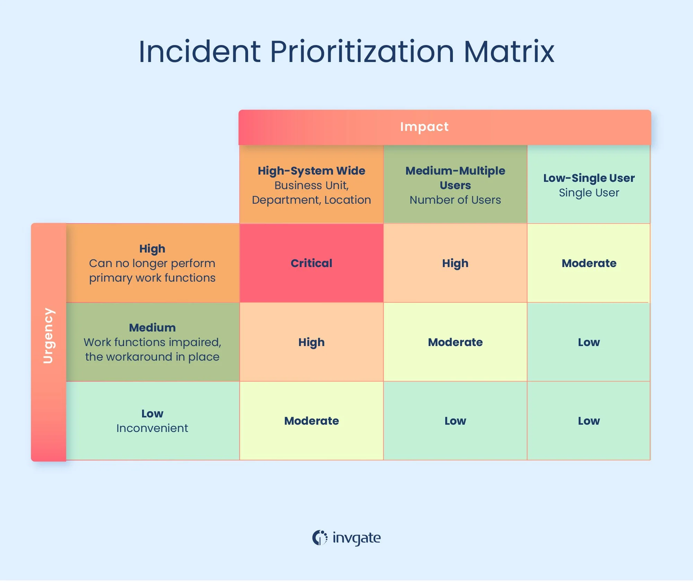

# Job description

## IT Support Technician  IT 支持技术员

[swazzy  摇摆的](https://au.indeed.com/cmp/Swazzy?campaignid=mobvjcmp&from=mobviewjob&tk=1j0o3ncnjq57c800&fromjk=63f80a4237f8e373)

Preston VIC 3072  普雷斯顿 VIC 3072
Hybrid work  混合工作
From $53,460.65 a year - Full-time 每年 53,460.65 美元起- 全日制

## Benefits  好处
- Referral program  推荐计划
- Employee discount  员工折扣

## Full job description  完整的职位描述

Position: IT Support Technician  
职位 ：IT 支持技术员  
Type: Full-Time  类型 ：全职  
Location: Onsite  地点 ：现场

About Us:  关于我们 ：  
Swazzy is a leading Managed Service Provider (MSP) dedicated to delivering comprehensive IT solutions and exceptional customer service. We support a diverse range of clients, ensuring their IT infrastructure is robust, secure, and efficient. As we continue to grow, we are seeking a skilled IT Support Technician to join our dynamic team.  
Swazzy 是一家领先的托管服务提供商 (MSP)，致力于提供全面的 IT 解决方案和卓越的客户服务。我们支持各类客户，确保他们的 IT 基础架构稳健、安全且高效。随着业务的不断发展，我们诚邀一位经验丰富的 IT 支持技术人员加入我们充满活力的团队。

Key Responsibilities:  
主要职责 ：

- Technical Support:  
    技术支援 ：
    
- Provide first-line technical support to clients, addressing hardware, software, and network-related issues.  
    为客户提供一线技术支持，解决硬件、软件和网络相关问题。
    
- Respond to service requests and troubleshoot technical problems both remotely and onsite.  
    响应服务请求并解决远程和现场的技术问题。
    
- Install, configure, and maintain computer systems, software, printers, and other peripheral devices.  
    安装、配置和维护计算机系统、软件、打印机和其他外围设备。
    
- Network Administration:  
    网络管理 ：
    
- Assist in the setup and maintenance of local area networks (LANs), wide area networks (WANs), and internet systems.  
    协助设置和维护局域网（LAN）、广域网（WAN）和互联网系统。
    
- Monitor network performance to ensure system availability and reliability.  
    监控网络性能以确保系统可用性和可靠性。
    
- Implement security measures to protect client data, software, and hardware.  
    实施安全措施来保护客户数据、软件和硬件。
    
- System Maintenance:  
    系统维护 ：
    
- Perform routine maintenance and updates on IT systems to ensure optimal performance.  
    对 IT 系统进行日常维护和更新，以确保最佳性能。
    
- Maintain an inventory of all IT equipment, software, and licenses.  
    维护所有 IT 设备、软件和许可证的清单。
    
- Create and manage user accounts, permissions, and passwords for client systems.  
    为客户端系统创建和管理用户帐户、权限和密码。
    
- Training and Support:  
    培训和支持 ：
    
- Provide technical support and training to end-users on various software and hardware systems.  
    为最终用户提供各种软件和硬件系统的技术支持和培训。
    
- Develop and maintain user guides and documentation for clients.  
    为客户开发和维护用户指南和文档。
    
- Problem Resolution:  
    问题解决 ：
    
- Identify and resolve technical issues through diagnostic techniques and pertinent questions.  
    通过诊断技术和相关问题识别并解决技术问题。
    
- Escalate unresolved issues to higher-level IT staff or external vendors as needed.  
    根据需要将未解决的问题上报给更高级别的 IT 人员或外部供应商。
    
- Collaboration:  合作 ：
    
- Work closely with the Swazzy IT team to implement and support IT initiatives and projects.  
    与 Swazzy IT 团队密切合作，实施和支持 IT 计划和项目。
    
- Collaborate with client IT departments to understand their needs and provide appropriate solutions.  
    与客户 IT 部门合作，了解他们的需求并提供适当的解决方案。
    

Qualifications:  资格 ：

- Associate or Bachelor's degree in Information Technology, Computer Science, or a related field.  
    信息技术、计算机科学或相关领域的副学士或学士学位。
    
- Proven experience as an IT Support Technician or similar role.  
    具有担任 IT 支持技术员或类似职位的经验。
    
- Strong knowledge of computer systems, mobile devices, and other tech products.  
    对计算机系统、移动设备和其他技术产品有深入的了解。
    
- Experience with network and server management.  
    具有网络和服务器管理经验。
    
- Familiarity with various operating systems (Windows, Mac OS, Linux) and office software.  
    熟悉各种操作系统（Windows、Mac OS、Linux）和办公软件。
    
- Excellent problem-solving and communication skills.  
    出色的解决问题和沟通能力。
    
- Ability to multitask and manage time effectively.  
    能够执行多项任务并有效地管理时间。
    
- Professional certifications (e.g., CompTIA A+, Microsoft Certified IT Professional) are a plus.  
    专业认证（例如 CompTIA A+、Microsoft 认证 IT 专业人员）是一项优势。
    

Work Schedule:  工作时间 ：

- Full-time position  全职职位
    
- Availability to work occasional evenings or weekends for maintenance and support tasks.  
    可以在偶尔的晚上或周末工作以执行维护和支持任务。
    

Job Type: Full-time  工作类型：全职

Pay: From $53,460.65 per year  
薪酬：每年 53,460.65 美元起

Benefits:  好处：

- Employee discount  员工折扣
    
- Referral program  推荐计划
    

Schedule:  日程：

- Afternoon shift  下午班
    
- Day shift  白班
    
- Evening shift  晚班
    
- Morning shift  早班
    
- On call  随叫随到
    

Supplementary Pay:  补充工资：

- Annual bonus  年度奖金
    
- Bonus  奖金
    
- Christmas bonus  圣诞奖金
    
- Commission  委员会
    
- Performance bonus  绩效奖金
    

Ability to commute/relocate:  
通勤/搬迁能力：

- Templestowe, VIC 3106: Reliably commute or planning to relocate before starting work (Preferred)  
    Templestowe, VIC 3106：可靠通勤或计划在开始工作前搬迁（首选）
    

Licence/Certification:  许可证/认证：

- Full Driver Licence (Required)  
    正式驾驶执照（必需）
    

Work Authorisation:  工作许可：

- Australia (Required)  澳大利亚（必填）
    

Willingness to travel:  出差意愿：

- 100% (Required)  100%（必填）
    

Work Location: Hybrid remote in Preston VIC 3072  
工作地点：Preston VIC 3072 混合远程

# 30-Minute Interview Script

  

# behavioural Questions
[Top 50 Technical Support Interview Questions and Answers - HiPeople](https://www.hipeople.io/interview-questions/technical-support-interview-questions)  

[Interview Questions for MSP Program Support - InterviewGemini](https://coreskills.interviewgemini.com/interviews/interview-questions-for-msp-program-support/?utm_source=chatgpt.com)   

[30 IT Support Technician Interview Questions and Answers - InterviewPrep](https://interviewprep.org/it-support-technician-interview-questions/?utm_source=chatgpt.com)  

## What are the steps you take when working with an end-user to solve a computer problem?  与最终用户合作解决计算机问题时您采取哪些步骤？

**Explanation**: This is a typical opening or general question. Interviewers use these types of questions to start the conversation, learn more about your background, and collect information they can use for subsequent questions.  
**解释** ：这是一个典型的开场白或一般性问题。面试官会用这类问题来开启对话，进一步了解你的背景，并收集可用于后续问题的信息。

**Example**: “When a user sends me a service ticket, the first thing I do is confirm I have the correct contact information so I can respond to them in a timely manner. I then review the issue and make sure I fully understand what problems they are encountering. Next, I triage the problem and determine the most likely cause. I then contact the user and start working through the issue, providing them instructions as to how to resolve the problem. If necessary, I do a remote login to their system so I can view their logs, run some commands, and reboot the system, if necessary.”  
**示例** ：“当用户向我发送服务单时，我首先会确认联系信息正确，以便及时回复。然后，我会审查问题，确保完全了解他们遇到的问题。接下来，我会对问题进行分类，并确定最可能的原因。之后，我会联系用户，开始解决问题，并指导他们如何解决问题。如有必要，我会远程登录他们的系统，查看日志、运行一些命令，并在必要时重启系统。”

##  What experience do you have with troubleshooting hardware issues?您在解决硬件问题方面有哪些经验？
“I’ve tackled a range of hardware issues—from desktop, laptop, and printer faults to more advanced setups. For example, I recently mirrored a failing Windows 11 device onto new hardware with zero data loss, helped a friend spec and build a custom gaming PC, and refurbished a Dell rack server for my homelab, swapping drives and updating firmware to bring it online. This hands-on experience lets me diagnose problems quickly and keep users productive.”我处理过各种各样的硬件问题——从台式机、笔记本电脑、打印机故障，到更高级的设置。例如，我最近将一台故障的 Windows 11 设备镜像到新硬件上，数据零丢失；帮助一位朋友定制并组装了一台游戏电脑；还为我的家庭实验室翻新了一台戴尔机架式服务器，更换了硬盘并更新了固件，使其恢复正常。这些实践经验让我能够快速诊断问题，并保证用户高效工作。

## How do you handle a situation where a user is frustrated with technical issues? 当用户因技术问题而感到沮丧时，您如何处理这种情况？
I approach frustrated users with empathy, actively listening to their concerns. I assure them that I am there to help, and I calmly guide them through steps to solve the issue, ensuring they feel supported throughout the process.
我会以同理心对待感到沮丧的用户，积极倾听他们的担忧。我向他们保证我会提供帮助，并耐心地指导他们逐步解决问题，确保他们在整个过程中都能感受到支持。
Example:  例子：
“I lead with empathy—listen first, reassure, then act. For instance, a user recently couldn’t sign in to the new Outlook desktop app and was getting increasingly frustrated. After acknowledging their concerns, I opened **Settings → Accounts → Email**, linked their mailbox, and then set Outlook Classic as the default mail handler. Login succeeded, their inbox synced, and the user left the call relieved and appreciative.”我以同理心引领——先倾听，再安抚，然后采取行动。例如，最近有一位用户无法登录新的 Outlook 桌面应用，并且越来越沮丧。在了解了他们的担忧后，我打开 **“设置”→“帐户”→“电子邮件”** ，关联他们的邮箱，然后将 Outlook Classic 设置为默认邮件处理程序。登录成功，收件箱同步，用户在通话结束时感到如释重负，并心怀感激。

## What is your experience with remote desktop support? 您对远程桌面支持有何经验？
I have extensive experience providing remote desktop support using tools like TeamViewer and Remote Desktop Protocol. This allows me to troubleshoot issues directly on users' systems, which enhances efficiency and minimizes response time.
我拥有丰富的使用 TeamViewer 和远程桌面协议等工具提供远程桌面支持的经验。这使我能够直接在用户系统上解决问题，从而提高效率并最大限度地缩短响应时间。
Example:  例子：

In my last position, I used remote support to assist employees with software installation issues, allowing me to resolve their problems quickly without needing to be physically present at their location.
在我上一份工作中，我使用远程支持来帮助员工解决软件安装问题，这样我就可以快速解决他们的问题，而无需亲自到他们那里。

## What steps do you take to ensure data security? 您采取哪些措施来确保数据安全？
To ensure data security, I implement strong password policies, perform regular software updates, and educate users about phishing. I also utilize antivirus software and regularly back up data to minimize the risk of loss.
为了确保数据安全，我实施了强密码策略，定期进行软件更新，并对用户进行网络钓鱼相关知识的培训。我还使用防病毒软件并定期备份数据，以最大程度地降低数据丢失的风险。
“I pair technical controls with user education. For example, I recently rolled out Microsoft Authenticator to add MFA to all cloud accounts, and—on a site still running on-prem Active Directory—I set a Group Policy that forces a password change every 180 days. Together with regular patching and phishing awareness tips, these measures keep our data far safer.”我将技术控制与用户教育相结合。例如，我最近推出了 Microsoft Authenticator，为所有云帐户添加了 MFA；此外，在一个仍在运行本地 Active Directory 的站点上，我设置了组策略，强制每 180 天更改一次密码。这些措施与定期补丁和网络钓鱼防范提示相结合，使我们的数据更加安全。

## Describe your experience with software installation and configuration.描述一下您的软件安装和配置经验。
I have extensive experience installing and configuring software across various platforms. I follow best practices for installation and ensure that configurations meet user needs while maintaining system integrity and security.
我拥有丰富的跨平台软件安装和配置经验。我遵循最佳实践进行安装，确保配置满足用户需求，同时维护系统的完整性和安全性。
Most recently I used PDQ Deploy to push our standard software stack—Chrome, 7-Zip, VPN client—silently to dozens of endpoints, pre-configuring switches and post-install scripts so users stayed productive. For ongoing maintenance I rely on Action1 RMM to schedule and verify Windows and third-party patch roll-outs, catching zero-day fixes quickly while keeping compliance reports clean.”我负责大规模安装。最近，我使用 PDQ Deploy 将我们的标准软件堆栈（Chrome、7-Zip、VPN 客户端）静默推送到数十个端点，预配置交换机和安装后脚本，以确保用户保持高效工作。对于持续维护，我依靠 Action1 RMM 来安排和验证 Windows 及第三方补丁的发布，快速捕获零日漏洞，同时确保合规性报告清晰。

## How do you keep your technical skills updated 你如何保持你的技术技能更新？
I keep my technical skills updated by attending workshops, taking online courses, and participating in webinars. I also follow industry blogs and forums to stay informed about the latest technologies and best practices.
我通过参加研讨会、在线课程和网络研讨会来保持技术技能的更新。我还关注行业博客和论坛，以了解最新技术和最佳实践。
Example:  例子：

I regularly enroll in online courses on platforms like Coursera and attend local tech meetups to learn about emerging trends and tools in IT support, ensuring my skills remain relevant.
我定期在 Coursera 等平台上注册在线课程，并参加当地的技术聚会，以了解 IT 支持领域的新兴趋势和工具，确保我的技能保持相关性。

## Can you describe a time when you had to troubleshoot a complex technical issue?您能描述一下您必须解决复杂技术问题的情况吗？
Situation情况
One user’s PC suddenly lost Internet while everyone else was fine. A new network printer had been added that morning.一名用户的电脑突然断网，而其他用户的电脑都正常。当天早上，新添加了一台网络打印机。

Task任务
Restore the user’s connectivity fast and prevent the issue recurring.快速恢复用户的连接并防止问题再次发生。

Action (walking the OSI stack)操作（遍历 OSI 堆栈

| Layer层                                             | Check / Finding检查/发现                                                                                                                                                    | Fix使固定                                                                              |
| -------------------------------------------------- | ----------------------------------------------------------------------------------------------------------------------------------------------------------------------- | ----------------------------------------------------------------------------------- |
| **1 Physical1 物理**                                 | Verified cable seated, link light on NIC -- OK.已验证电缆已就位，NIC 上的链接灯亮起 - 正常。                                                                                               | —                                                                                   |
| **2 Data Link2 数据链路**                              | `ipconfig /all` showed correct MAC but ARP table had duplicate IP → MAC mismatch. Suspected collision.`ipconfig /all` 显示 MAC 地址正确，但 ARP 表显示重复 IP 地址 → MAC 地址不匹配。怀疑存在冲突。 | Cleared ARP cache; still failing.清除 ARP 缓存；仍然失败。                                    |
| **3 Network3 网络**                                  | Ping to gateway timed out; DHCP server logs revealed the same IP leased to both the user’s PC and the new printer.ping 网关超时；DHCP 服务器日志显示用户 PC 和新打印机租用了相同的 IP。           | Re-leased a fresh IP to the PC, confirmed routing restored.重新释放一个新的 IP 给 PC，确认路由恢复。 |
| **4 Transport / 5-7 Session-App4 传输 / 5-7 会话应用程序** | Browsers and Outlook now loaded, confirming higher layers healthy.浏览器和 Outlook 现已加载，确认更高层级健康。                                                                           | —                                                                                   |

Resolution / Prevention解决/预防*
We isolated all printers + CCTV cameras onto a dedicated VLAN with their own DHCP scope, then updated switch ACLs so client VLANs can’t collide again. No further IP conflicts reported.我们将所有打印机和闭路电视摄像头隔离到具有各自 DHCP 范围的专用 VLAN 上，然后更新了交换机的 ACL，这样客户端 VLAN 就不会再发生冲突了。之后没有再报告任何 IP 冲突。

Result结果
User back online within 10 minutes, and the VLAN segregation eliminated a recurring conflict risk for ~40 IoT devices.”用户在 10 分钟内恢复上线，VLAN 隔离消除了约 40 台物联网设备反复发生冲突的风险。”

## Can you explain the importance of documentation in IT support?您能解释一下文档在 IT 支持中的重要性吗？
Documentation is crucial for maintaining a clear record of issues, resolutions, and procedures. It helps streamline the support process, ensures consistency, and serves as a valuable resource for training new staff and resolving future incidents effectively.
文档对于清晰记录问题、解决方案和流程至关重要。它有助于简化支持流程，确保一致性，并作为培训新员工和有效解决未来事件的宝贵资源。
Example:  例子：

I always document each support ticket, noting the problem and solution. This practice not only aids in future troubleshooting but also helps my colleagues learn from past issues, ultimately improving our team's efficiency.
我总是记录每一条支持工单，记录问题和解决方案。这种做法不仅有助于将来的故障排除，还能帮助我的同事从过去的问题中吸取教训，最终提高我们团队的效率。

## (ITIL Priority Matrix) How do you prioritize multiple IT support requests from different users? 如何对来自不同用户的多个 IT 支持请求进行优先排序？
[ITIL Priority Matrix: How to Use it for Incident, Problem, Service Request, and Change Management](https://blog.invgate.com/itil-priority-matrix)  

_When faced with multiple IT support requests, I prioritize them based on the urgency and impact of each issue on the business operations. First, I assess if any request is related to a critical system or process that could significantly affect productivity or revenue generation. These high-priority issues are addressed immediately to minimize downtime and potential losses._  
**示例：** _“当面临多个 IT 支持请求时，我会根据每个问题的紧急程度及其对业务运营的影响来确定优先级。首先，我会评估是否有任何请求与可能显著影响生产力或创收的关键系统或流程相关。这些高优先级问题会立即得到处理，以最大限度地减少停机时间和潜在损失。”_

For non-critical requests, I consider factors such as the number of users affected, the severity of the problem, and any deadlines associated with the task. This helps me create a balanced approach in addressing user concerns while ensuring efficient use of my time and resources. Additionally, I maintain open communication with users to keep them informed about the progress of their requests and manage their expectations accordingly.”  
对于非关键请求，我会考虑受影响的用户数量、问题的严重性以及与任务相关的截止日期等因素。这有助于我制定一个平衡的方案，在解决用户问题的同时，确保高效利用我的时间和资源。此外，我会与用户保持开放的沟通，让他们了解请求的进展情况，并相应地管理他们的期望。

--- 
# Technical Questions  技术问题

## What steps would you take to resolve a printer issue 您将采取哪些步骤来解决打印机问题？
As an IT support professional, you’ll be expected to troubleshoot and resolve a variety of technical issues, including those related to printers. This question aims to assess your problem-solving skills, technical knowledge, and ability to communicate clear instructions to users who may be less tech-savvy. Your response will demonstrate your expertise in diagnosing issues and following a logical process to resolve them effectively.
作为一名 IT 支持专业人员，您需要排除故障并解决各种技术问题，包括与打印机相关的问题。此问题旨在评估您的问题解决能力、技术知识以及向技术水平较低的用户清晰传达说明的能力。您的回答将展现您在诊断问题和遵循逻辑流程有效解决问题方面的专业技能。

Example: “When resolving a printer issue, I would first gather information from the user about the specific problem they are experiencing. This helps me understand if it’s an isolated incident or a more widespread issue. Next, I would verify that the printer is properly connected to the network and powered on. If there are no connectivity issues, I would check for any error messages displayed on the printer itself, which could indicate problems such as paper jams, low ink levels, or hardware malfunctions.
示例： “解决打印机问题时，我会首先向用户收集他们遇到的具体问题信息。这有助于我了解这是一个孤立事件还是一个更广泛的问题。接下来，我会验证打印机是否已正确连接到网络并已打开电源。如果没有连接问题，我会检查打印机本身是否显示任何错误消息，这些信息可能表明存在卡纸、墨水量不足或硬件故障等问题。”

If the issue persists after addressing any visible errors, I would then examine the print queue on the user’s computer to ensure there are no stuck jobs causing delays. Clearing the print queue and restarting both the printer and the user’s computer can often resolve many common printing issues. If necessary, I would also confirm that the correct drivers are installed and up-to-date on the user’s system. Throughout this process, I maintain clear communication with the user, keeping them informed of my progress and ensuring their needs are met in a timely manner.”
如果在解决任何可见错误后问题仍然存在，我会检查用户计算机上的打印队列，确保没有卡住的作业导致延迟。清除打印队列并重新启动打印机和用户计算机通常可以解决许多常见的打印问题。如有必要，我还会确认用户系统上安装了正确的驱动程序并且是最新版本。在整个过程中，我会与用户保持清晰的沟通，让他们了解我的进展，并确保及时满足他们的需求。

## Explain the difference between a hub, switch, and router.  解释集线器、交换机和路由器之间的区别。

This question tests your technical knowledge and demonstrates your understanding of essential networking components. When working in IT support, you will often troubleshoot and configure networks, so it’s important to know the specific functions of each device and how they contribute to the overall network performance. Knowing the difference between a hub, switch, and router also highlights your ability to communicate technical concepts to non-technical colleagues or clients.  
这个问题考察你的技术知识，并展现你对基本网络组件的理解。在 IT 支持工作中，你经常需要排除网络故障并进行配置，因此了解每个设备的具体功能以及它们对整体网络性能的影响至关重要。了解集线器、交换机和路由器之间的区别，还能凸显你与非技术同事或客户沟通技术概念的能力。

**Example:** _“A hub, switch, and router are all networking devices that serve different purposes in a network infrastructure._  
**示例：** _“集线器、交换机和路由器都是在网络基础设施中服务于不同用途的网络设备。_

A hub is the simplest of the three, functioning as a basic repeater that broadcasts incoming data packets to all connected devices on the network. It operates at the physical layer (Layer 1) of the OSI model and does not have any intelligence to determine the destination of the data packets, which can lead to increased network congestion.  
集线器是三者中最简单的，其功能类似于基本的中继器，将传入的数据包广播到网络上所有连接的设备。它运行在 OSI 模型的物理层（第 1 层），无法智能地确定数据包的目的地，这可能会导致网络拥塞加剧。

A switch, on the other hand, is more advanced than a hub. It operates at the data link layer (Layer 2) of the OSI model and intelligently forwards data packets only to their intended recipients based on MAC addresses. This reduces network congestion and improves overall efficiency.  
另一方面，交换机比集线器更先进。它运行在 OSI 模型的数据链路层（第 2 层），并根据 MAC 地址智能地将数据包仅转发给目标接收者。这可以减少网络拥塞并提高整体效率。

A router is the most sophisticated among these devices, operating at the network layer (Layer 3) of the OSI model. Its primary function is to connect multiple networks together and route data packets between them based on IP addresses. Routers also provide additional features such as Network Address Translation (NAT), Dynamic Host Configuration Protocol (DHCP), and firewall capabilities, making them essential for managing complex network environments.”  
路由器是这些设备中最复杂的，运行在 OSI 模型的网络层（第 3 层）。其主要功能是将多个网络连接在一起，并根据 IP 地址在它们之间路由数据包。路由器还提供其他功能，例如网络地址转换（NAT）、动态主机配置协议（DHCP）和防火墙功能，使其成为管理复杂网络环境的关键。

##  Can you explain the OSI model and its relevance to IT support?您能解释一下 OSI 模型及其与 IT 支持的相关性吗？
The OSI model, or Open Systems Interconnection model, is a foundational concept in networking and IT support. By asking this question, interviewers aim to assess your understanding of network fundamentals and how they apply to real-world IT support scenarios. Grasping the seven-layered structure of the OSI model is essential for diagnosing, troubleshooting, and resolving network-related issues effectively and efficiently.
OSI 模型，即开放系统互连模型，是网络和 IT 支持领域的基础概念。面试官通过提出这个问题，旨在评估你对网络基础知识的理解，以及这些知识如何应用于实际的 IT 支持场景。掌握 OSI 模型的七层结构对于有效、高效地诊断、排除故障和解决网络相关问题至关重要。

Example: “The OSI (Open Systems Interconnection) model is a conceptual framework that standardizes the functions of a telecommunication or computing system into seven distinct layers. These layers help to understand how data is transmitted and received over a network, which is essential for IT support professionals when troubleshooting network-related issues.
示例： “OSI（开放系统互连）模型是一个概念框架，它将电信或计算系统的功能标准化为七个不同的层。这些层有助于理解数据在网络上的传输和接收方式，这对于 IT 支持专业人员在排除网络相关问题时至关重要。”

The seven layers are: 1. Physical Layer – Deals with the physical connection between devices, such as cables and switches.2. Data Link Layer – Manages error detection and correction in data transmission, as well as flow control.3. Network Layer – Responsible for routing and forwarding packets across networks.4. Transport Layer – Ensures reliable data transfer by managing end-to-end connections and error recovery.5. Session Layer – Establishes, maintains, and terminates sessions between applications on different devices.6. Presentation Layer – Translates data formats and handles encryption/decryption for secure communication.7. Application Layer – Provides the interface between user applications and the underlying network services.
这七层分别是：1. 物理层 - 处理设备之间的物理连接，例如电缆和交换机。2. 数据链路层 - 管理数据传输中的错误检测与纠正以及流量控制。3. 网络层 - 负责跨网络路由和转发数据包。4. 传输层 - 通过管理端到端连接和错误恢复来确保可靠的数据传输。5. 会话层 - 建立、维护和终止不同设备上的应用程序之间的会话。6. 表示层 - 转换数据格式并处理加密/解密以确保安全通信。7. 应用层 - 提供用户应用程序和底层网络服务之间的接口。

As an IT support professional, understanding the OSI model helps diagnose and resolve networking issues more effectively. For example, if there’s a problem with data not being transmitted correctly, we can use our knowledge of the OSI model to pinpoint whether it’s due to a physical layer issue like a faulty cable or a higher-level issue like incorrect application settings. This targeted approach saves time and resources while ensuring efficient resolution of network problems.”
作为 IT 支持专业人员，了解 OSI 模型有助于更有效地诊断和解决网络问题。例如，如果出现数据无法正确传输的问题，我们可以利用对 OSI 模型的了解来查明问题是由于物理层问题（例如电缆故障）还是更高级别的问题（例如应用程序设置不正确）造成的。这种有针对性的方法可以节省时间和资源，同时确保高效解决网络问题。

## Can you explain the concept of subnetting in IP addressing? 您能解释一下 IP 寻址中的子网划分概念吗？
[Subnet Cheat Sheet – 24 Subnet Mask, 30, 26, 27, 29, and other IP Address CIDR Network References](https://www.freecodecamp.org/news/subnet-cheat-sheet-24-subnet-mask-30-26-27-29-and-other-ip-address-cidr-network-references/) 
Subnetting is a key concept in networking, and interviewers want to ensure that you have a solid understanding of it. As an IT support professional, you may need to troubleshoot network issues, design or optimize network structures, or even configure devices to work within specific network environments. Demonstrating your knowledge of subnetting shows that you have the technical expertise to handle these tasks and contribute to the efficient operation of the organization’s network infrastructure.
子网划分是网络中的一个关键概念，面试官希望确保你对此有扎实的理解。作为一名 IT 支持专业人员，你可能需要排除网络故障、设计或优化网络结构，甚至配置设备使其在特定的网络环境中工作。展现你对子网划分的了解，表明你具备处理这些任务的技术专长，并为组织网络基础设施的高效运行做出贡献。
 Subnetting is a technique used to divide an IP network into smaller, more manageable subnetworks or subnets. It involves modifying the default subnet mask of an IP address, which allows for better control over IP allocation and improved network security.
子网划分是一种将 IP 网络划分为更小、更易于管理的子网或子网的技术。它涉及修改 IP 地址的默认子网掩码，从而可以更好地控制 IP 分配并提高网络安全性。”

The process starts by borrowing bits from the host portion of the IP address and using them to create additional network segments. This results in a custom subnet mask that defines the new subnets. The primary goal of subnetting is to optimize the use of available IP addresses while minimizing the impact on routing tables and overall network performance. In practice, subnetting helps organizations efficiently manage their networks, reduce congestion, and enhance security by isolating different parts of the network from each other.”
该过程首先从 IP 地址的主机部分借用一些位，并用它们创建额外的网段。这将生成一个自定义子网掩码，用于定义新的子网。子网划分的主要目标是优化可用 IP 地址的使用，同时最大限度地减少对路由表和整体网络性能的影响。实际上，子网划分通过将网络的不同部分彼此隔离，可以帮助组织高效地管理其网络，减少拥塞并增强安全性。

## What’s the difference between a switch and a router? 交换机和路由器有什么区别？  
A switch connects devices in a LAN; a router connects different networks and routes data packets. 交换机连接局域网内的设备；路由器连接不同的网络并路由数据包。

## How do you troubleshoot a blue screen (BSOD)?  如何排除蓝屏（BSOD）故障？  
Note the stop code, check hardware drivers, analyze memory dumps, and test RAM and disk health.  注意停止代码，检查硬件驱动程序，分析内存转储，并测试 RAM 和磁盘健康状况。

## What tools do you use for remote support?  您使用什么工具进行远程支持？ 
TeamViewer, AnyDesk, Remote Desktop, or Chrome Remote Desktop depending on policy.  根据策略，可以使用 TeamViewer、AnyDesk、远程桌面或 Chrome 远程桌面。

## How do you handle printer issues?  如何处理打印机问题？
Restart spooler service, check connections and drivers, verify queue status, and test from another device.  重新启动后台处理程序服务，检查连接和驱动程序，验证队列状态，并从另一台设备进行测试。

## What is DHCP and DNS?  什么是 DHCP 和 DNS？  
DHCP assigns IP addresses automatically; DNS translates domain names to IP addresses.  DHCP 自动分配 IP 地址；DNS 将域名转换为 IP 地址。

## How would you upgrade a user's hardware?  您将如何升级用户的硬件？ 
Assess compatibility, backup data, physically install components, update drivers, and test functionality.  评估兼容性、备份数据、物理安装组件、更新驱动程序和测试功能。

## What is Active Directory used for?  Active Directory 用于什么？  
It manages user authentication, permissions, and access to networked resources in a Windows environment.  它管理 Windows 环境中的用户身份验证、权限和对网络资源的访问。
## How do you resolve slow computer performance?  如何解决计算机性能缓慢的问题？  
Check startup programs, run malware scans, verify RAM and CPU usage, and clean temp files.  检查启动程序、运行恶意软件扫描、验证 RAM 和 CPU 使用情况以及清理临时文件。

## What’s the purpose of a firewall?  防火墙的用途是什么？ 
To filter incoming/outgoing traffic and block unauthorized access.  过滤传入/传出流量并阻止未经授权的访问。

## How do you back up and restore files?  如何备份和恢复文件？ 
Use cloud storage, Windows File History, or third-party tools, and restore via backup snapshots or tools.  使用云存储、Windows 文件历史记录或第三方工具，并通过备份快照或工具进行恢复。

---
# Cultural Fit Questions 
## 1 What do you value most in a workplace?1 在工作场所您最看重什么？

**Why they ask:** To see whether your personal values line up with theirs (e.g., collaboration, learning, customer service).**他们为什么问：** 看看你的个人价值观是否与他们的一致（例如，合作、学习、客户服务）。

**Answer (≈20 s)回答（≈20秒）**

> “I thrive where two things are clear: **shared purpose and open knowledge-sharing**. In my last internship the dev and analyst sat side-by-side; we posted quick ‘fix scripts’ to a team channel so nobody solved the same problem twice. That transparency helped us deliver faster and made work more fun.”“在两件事明确的地方，我才能蓬勃发展： **共同的目标和开放的知识共享** 。在我上一份实习中，开发人员和分析师并肩坐在一起；我们将快速的“修复脚本”发布到团队频道，这样就不会有人重复解决同一个问题。这种透明度帮助我们更快地交付，并使工作更有趣。”

## 2 How do you stay motivated during repetitive tasks like password resets?2 在执行诸如密码重置之类的重复性任务时，您如何保持动力？

**Why they ask:** Service-desk jobs have routine elements; they want to know you won’t burn out.**他们为什么问这个问题：** 服务台工作有例行工作元素；他们想知道你不会精疲力竭。

**Answer回答**

> “I keep the bigger picture in mind: every reset means a user back to productive work. I also batch similar tickets and use PDQ/PowerShell snippets to speed them up, turning routine work into a small efficiency challenge.”我始终牢记全局：每次重置都意味着用户重新投入高效工作。我还会批量处理类似的工单，并使用 PDQ/PowerShell 代码片段来加快处理速度，将日常工作变成一项小小的效率挑战。

## 3 Describe a time you disagreed with a teammate. How did you handle it?3 描述一次你不同意

**Answer回答**

> “While setting up VLANs for printers, a colleague argued the change was overkill. Instead of debating configurations, we pulled switch-port stats and showed duplicate-IP incidents dropping after a test VLAN. The data persuaded him, and we rolled out the change together. I focus on facts, not egos.”在为打印机设置 VLAN 时，一位同事认为这项更改有些过度。我们没有讨论配置，而是提取了交换机端口统计数据，结果显示重复 IP 事件在测试 VLAN 后就消失了。数据说服了他，我们一起实施了这项更改。我注重事实，而不是自负。

## 4 What does “excellent customer service” mean to you in IT support?4 在 IT 支持方面，“卓越的客户服务”对您来说意味着什么？

**Answer回答**

> “It’s empathy plus follow-through. Users remember **how** you made them feel, not which CLI command you ran. I always start with a plain-English recap of their issue, agree on next steps, then close the loop with a quick ‘here’s what we fixed and how to avoid it next time.’”“这需要同理心和后续行动。用户会记住你给他们带来的**感受** ，而不是你运行了哪个 CLI 命令。我总是先用通俗易懂的英语回顾一下他们的问题，然后商定下一步措施，最后用一句简短的‘这是我们修复的问题以及下次如何避免’来结束讨论。”

## 5 How do you keep learning when budgets or formal training are limited?5 当预算或正规培训有限时，您如何继续学习？

**Answer回答**

> “I spin up labs on my Dell rack server; breaking and fixing VMs costs nothing. Recently I mirrored a failing Windows 11 drive, then documented the process as an internal KB article. Sharing what I learn multiplies the value.”我在我的戴尔机架式服务器上运行实验；虚拟机的故障和修复无需任何成本。最近，我镜像了一个故障的 Windows 11 驱动器，并将整个过程记录为一篇内部知识库文章。分享我学到的知识，价值倍增。

## 6 We sometimes need to jump on urgent tickets after hours. How do you feel about that?6 我们有时需要在下班后处理紧急工单。您对此有何看法？

**Answer回答**

> “I understand IT doesn’t sleep. I’m comfortable with a rotating on-call roster—as long as expectations are clear and the team balances the load fairly.”我理解 IT 部门的繁忙。我接受轮班制——只要预期明确，团队能够公平地平衡工作量。

## 7 Give an example of contributing to team culture outside your core duties.7 举例说明在核心职责之外对团队文化做出的贡献。

**Answer回答**

> “At RANS Australia I set up a ‘Fix of the Week’ Slack thread where we’d post before/after screenshots of tricky tickets. It became a friendly brag board and a searchable mini-KB, boosting both morale and knowledge.”在 RANS 澳大利亚，我创建了一个“每周修复”的 Slack 讨论组，我们会在其中发布棘手工单的修复前后截图。它变成了一个友好的自夸板块和一个可搜索的迷你知识库，既鼓舞了士气，又增进了知识。

## 8 Why do you think our company is a good fit for you?8 您为什么认为我们公司适合您？

**Tailor this with details from their website/values. Example:根据他们网站/价值观的细节进行定制。例如：**

> “Your focus on small-business clients resonates with me; I like seeing the impact of a solved ticket immediately on someone’s day. Your emphasis on mentorship also aligns with my goal to progress from Level 1 to Level 2 while helping newer hires behind me.”您对小型企业客户的关注引起了我的共鸣；我很高兴看到解决的工单立即对客户一天的工作产生积极的影响。您对导师制的重视也与我的目标相符，即从一级晋升到二级，同时帮助我身后的新员工。

